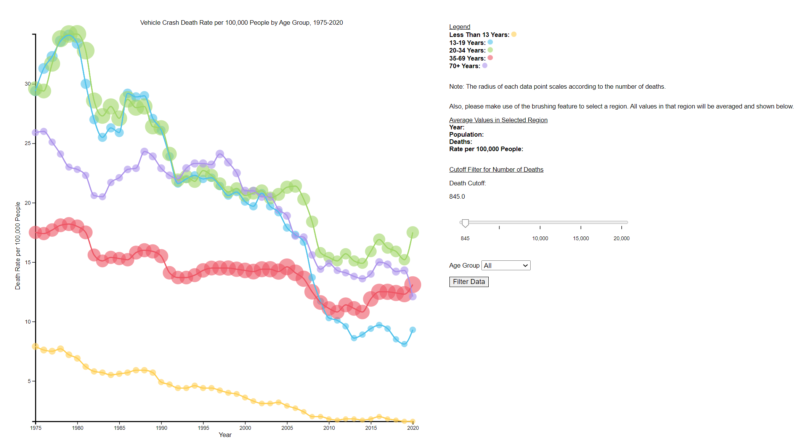

# Crash Death Visualization
Interactive scatterplot to visualize motor vehicle crash death data per 100,000 by age group from 1975 - 2020.

Includes the following functionality:
- Displays average deaths, rate, and population for values in any selected brush region.
- Displays year, age group, population, deaths, and rate for any value that is hovered over.
- Filters data based on a cutoff value for rate.

View a demo of our visualization [here](https://youtu.be/M2sWbD5Tf5k).

Data found from the [U.S. Department of Transportation](https://www.iihs.org/topics/fatality-statistics/detail/yearly-snapshot).

## Run the Visualization
In the directory, run `python -m http.server 8080` to start the server.
Then, open `localhost:8080` in any browser.